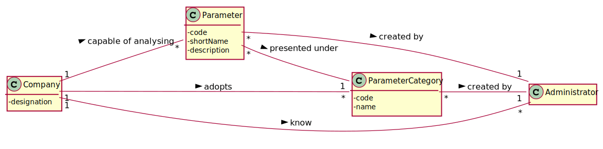

# US 10 - to specify a new parameter and categorize it

## 1. Requirements Engineering

### 1.1. User Story Description

As an administrator, I want to specify a new parameter and categorize it.

### 1.2. Customer Specifications and Clarifications 

**From the specifications document:**

> "Blood tests are frequently characterized by measuring several parameters which for presentation/reporting purposes are organized by categories. For example, parameters such as the number of Red Blood Cells (RBC), White Blood Cells (WBC) and Platelets (PLT) are usually presented under the blood count (Hemogram) category."

> “Regardless, such tests rely on measuring one or more parameters that can be grouped/organized by categories.”

> "Covid tests are characterized by measuring a single parameter stating whether it is a positive or a negative result"

**From the client clarifications:**

> **Question:** "What is the data that characterize a parameter? Should we follow the same data as the parameter category, for example, would each parameter have its own code, description and NHS identifier?"
>  
> **Answer:** "Each parameter is associated with one category. Each parameter has a Code, a Short Name and a Description."

>Read the whole answer [here](https://moodle.isep.ipp.pt/mod/forum/discuss.php?d=7507#p10106).

-

> **Question:** "Is there any acceptance criteria for these data other than those shown in the US11 of the parameter category?"
>  
> **Answer:** "The Code are five alphanumeric characters. The Short Name is a String with no more than 8 characters. The Description is a String with no more than 20 characters."

>Read the whole answer [here](https://moodle.isep.ipp.pt/mod/forum/discuss.php?d=7507#p10106).

-

> **Question:** "Can a parameter be classified in more than one parameter category?"
> 
>  **Answer:** "No. Each parameter has only one category. There are no subcategories."

>Read the whole answer [here](https://moodle.isep.ipp.pt/mod/forum/discuss.php?d=7749#p10124).

-

> **Question:** "Does the client want to specify more than one new parameter at a time?"
>
> **Answer:** "Yes."

>Read the whole answer [here](https://moodle.isep.ipp.pt/mod/forum/discuss.php?d=7616#p10189).

-

> **Question:** "When a new parameter is specified, should there always be a category it falls under prior to its specification and subsequent categorization?"
>
> **Answer:** "Each parameter is associated with one category."

>Read the whole answer [here](https://moodle.isep.ipp.pt/mod/forum/discuss.php?d=7616#p10189).

-

> **Question:** "Does the administrator need to log in order to create a parameter and categorize it?"
>
> **Answer:** "Yes"

>Read the whole answer [here](https://moodle.isep.ipp.pt/mod/forum/discuss.php?d=7639#p10195).

-

> **Question:** "Is the categorization of a parameter mandatory or optional?"
>
> **Answer:** "Yes."

>Read the whole answer [here](https://moodle.isep.ipp.pt/mod/forum/discuss.php?d=7649#p10196).

-

> **Question:** "How does the assignment of a parameter category works? Does he have to select the category or he have the option to create in the moment?"
>
> **Answer:** "There exists a user story to specify a new parameter category. Therefore, the administrator should select one category when creating a parameter."

>Read the whole answer [here](https://moodle.isep.ipp.pt/mod/forum/discuss.php?d=7649#p10196).

-

> **Question:** "The administrator needs to be logged in to execute his role?"
>
> **Answer:** "Yes."

>Read the whole answer [here](https://moodle.isep.ipp.pt/mod/forum/discuss.php?d=7666#p10200).

-

> **Question:** "Is the administrator an employee? If he/she is, who does him/her register?"
>
> **Answer:** "Yes. An administrator should be registered when the application starts for first time.
The application can have more than one administrator."

>Read the whole answer [here](https://moodle.isep.ipp.pt/mod/forum/discuss.php?d=7666#p10200).

-
-

> **Question:** "What data does the parameter have and what type / format should they have?"
>
> **Answer:** yyyy.

>Read the whole answer [here](https://moodle.isep.ipp.pt/mod/forum/discuss.php?d=7678#p10003).

-

> **Question:** "Does the data (code, description, and National Health Service ID) in the parameter category have any acceptance criteria? If yes, what acceptance criteria."
>
> **Answer:** yyyy.

>Read the whole answer [here](https://moodle.isep.ipp.pt/mod/forum/discuss.php?d=7678#p10003).

-

> **Question:** "When creating a new parameter, if the category does not exist in the system, should the administrator have the possibility to create a new one, or he must categorize it in the existing ones."
>
> **Answer:** yyyy.

>Read the whole answer [here](https://moodle.isep.ipp.pt/mod/forum/discuss.php?d=7678#p10003).

### 1.3. Acceptance Criteria

* **AC1:** The Code are five alphanumeric characters.
* **AC2:** The Short Name is a String with no more than 8 characters.
* **AC3:** The Description is a String with no more than 20 characters.

### 1.4. Found out Dependencies

* There is a dependency to "US 11 To specify a new parameter category" since the parameter categories must exist to categorize new parameters.

### 1.5 Input and Output Data

**Input Data:**

* Typed data:
	* parameter code
	* short name
	* description
	
* Selected data:
	* Parameter category

**Output Data:**

* (In)Sucess of the operation

### 1.6. System Sequence Diagram (SSD)

### 1.7 Other Relevant Remarks

*Use this section to capture other relevant information that is related with this US such as (i) special requirements ; (ii) data and/or technology variations; (iii) how often this US is held.* 

## 2. OO Analysis

### 2.1. Relevant Domain Model Excerpt 
*In this section, it is suggested to present an excerpt of the domain model that is seen as relevant to fulfill this requirement.* 

### 2.2. Other Remarks

*Use this section to capture some aditional notes/remarks that must be taken into consideration into the design activity. In some case, it might be usefull to add other analysis artifacts (e.g. activity or state diagrams).* 

## 3. Design - User Story Realization 

### 3.1. Rationale

**The rationale grounds on the SSD interactions and the identified input/output data.**

| Interaction ID | Question: Which class is responsible for... | Answer  | Justification (with patterns)  |
|:-------------  |:--------------------- |:------------|:---------------------------- |
| Step 1  		 |	... interacting with the actor? | CreateParameterUI | Pure Fabrication: there is no reason to assign this responsibility to any existing class in the Domain Model. |
|       	   	 |	... coordinating the US? | CreateParameterController | Controller |
|       	   	 |	... instantiating a new Parameter? | Administrator | ??? |
| 			  		 | ... knowing the user using the system?  | UserSession  | ??? |
| Step 2  		 |							 |             |                              |
| Step 3  		 |	...saving the inputted data? | Parameter  | IE: object created in step 1 has its own data.  |
| Step 4  		 |	...knowing the parameter categories to show? | Platform  | IE: Parameter Categories are defined by the Platform. |
| Step 5  		 |	... saving the selected category? | Parameter  | IE: object created in step 1 is classified in one Category.  |
| Step 6  		 |	... validating all data (local validation)? | Parameter | IE: owns its data.|
| 			  	 |	... validating all data (global validation)? | Company | IE: knows all its parameters.|
| Step 7		 |	... saving the created parameter? | Company | IE: owns all its parameters.|
| Step 8  		 |	... informing operation success?| CreateParameterUI  | IE: is responsible for user interactions.  |

### Systematization ##

According to the taken rationale, the conceptual classes promoted to software classes are: 

 * Administrator
 * Platform
 * Company
 * Parameter

Other software classes (i.e. Pure Fabrication) identified: 
 * CreateParameterUI  
 * CreateParameterController

## 3.2. Sequence Diagram (SD)

*In this section, it is suggested to present an UML dynamic view stating the sequence of domain related software objects' interactions that allows to fulfill the requirement.* 

## 3.3. Class Diagram (CD)

*In this section, it is suggested to present an UML static view representing the main domain related software classes that are involved in fulfilling the requirement as well as and their relations, attributes and methods.*

# 4. Tests 
*In this section, it is suggested to systematize how the tests were designed to allow a correct measurement of requirements fulfilling.* 

**_DO NOT COPY ALL DEVELOPED TESTS HERE_**

**Test 1:** Check that it is not possible to create an instance of the Example class with null values. 

	@Test(expected = IllegalArgumentException.class)
		public void ensureNullIsNotAllowed() {
		Exemplo instance = new Exemplo(null, null);
	}

*It is also recommended to organize this content by subsections.* 

# 5. Construction (Implementation)

*In this section, it is suggested to provide, if necessary, some evidence that the construction/implementation is in accordance with the previously carried out design. Furthermore, it is recommeded to mention/describe the existence of other relevant (e.g. configuration) files and highlight relevant commits.*

*It is also recommended to organize this content by subsections.* 

# 6. Integration and Demo 

*In this section, it is suggested to describe the efforts made to integrate this functionality with the other features of the system.*

# 7. Observations

*In this section, it is suggested to present a critical perspective on the developed work, pointing, for example, to other alternatives and or future related work.*