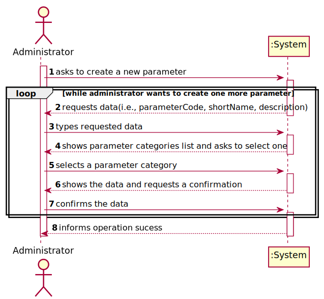
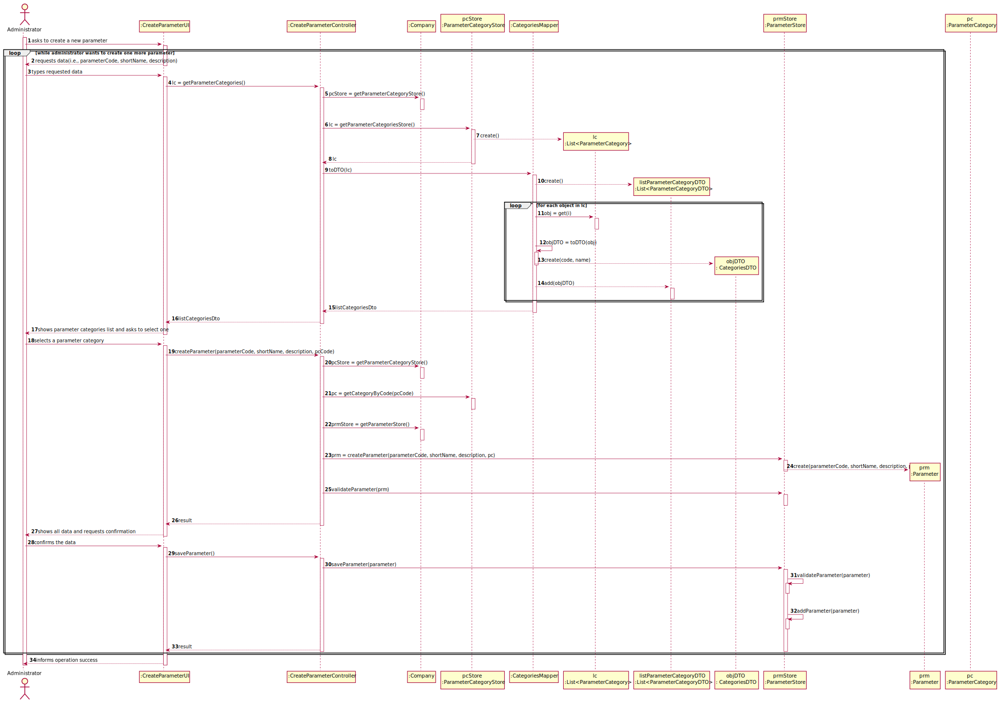

# US 10 - to specify a new parameter and categorize it

## 1. Requirements Engineering

### 1.1. User Story Description

As an administrator, I want to specify a new parameter and categorize it.

### 1.2. Customer Specifications and Clarifications 

**From the specifications document:**

> "Blood tests are frequently characterized by measuring several parameters which for presentation/reporting purposes are organized by categories. For example, parameters such as the number of Red Blood Cells (RBC), White Blood Cells (WBC) and Platelets (PLT) are usually presented under the blood count (Hemogram) category."

> “Regardless, such tests rely on measuring one or more parameters that can be grouped/organized by categories.”

> "Covid tests are characterized by measuring a single parameter stating whether it is a positive or a negative result"

**From the client clarifications:**

> **Question:** "What is the data that characterize a parameter? Should we follow the same data as the parameter category, for example, would each parameter have its own code, description and NHS identifier?"
>  
> **Answer:** "Each parameter is associated with one category. Each parameter has a Code, a Short Name and a Description.
> The Code are five alphanumeric characters. The Short Name is a String with no more than 8 characters. The Description is a String with no more than 20 characters."

>Read the whole answer [here](https://moodle.isep.ipp.pt/mod/forum/discuss.php?d=7507#p10106).

-

> **Question:** "Is there any acceptance criteria for these data other than those shown in the US11 of the parameter category?"
>  
> **Answer:** "The Code are five alphanumeric characters. The Short Name is a String with no more than 8 characters. The Description is a String with no more than 20 characters."

>Read the whole answer [here](https://moodle.isep.ipp.pt/mod/forum/discuss.php?d=7507#p10106).

-

> **Question:** "Can a parameter be classified in more than one parameter category?"
> 
>  **Answer:** "No. Each parameter has only one category. There are no subcategories."

>Read the whole answer [here](https://moodle.isep.ipp.pt/mod/forum/discuss.php?d=7749#p10124).

-

> **Question:** "Does the client want to specify more than one new parameter at a time?"
>
> **Answer:** "Yes."

>Read the whole answer [here](https://moodle.isep.ipp.pt/mod/forum/discuss.php?d=7616#p10189).

-

> **Question:** "When a new parameter is specified, should there always be a category it falls under prior to its specification and subsequent categorization?"
>
> **Answer:** "Each parameter is associated with one category."

>Read the whole answer [here](https://moodle.isep.ipp.pt/mod/forum/discuss.php?d=7616#p10189).

-

> **Question:** "Does the administrator need to log in order to create a parameter and categorize it?"
>
> **Answer:** "Yes"

>Read the whole answer [here](https://moodle.isep.ipp.pt/mod/forum/discuss.php?d=7639#p10195).

-

> **Question:** "Is the categorization of a parameter mandatory or optional?"
>
> **Answer:** "Yes."

>Read the whole answer [here](https://moodle.isep.ipp.pt/mod/forum/discuss.php?d=7649#p10196).

-

> **Question:** "How does the assignment of a parameter category works? Does he have to select the category or he have the option to create in the moment?"
>
> **Answer:** "There exists a user story to specify a new parameter category. Therefore, the administrator should select one category when creating a parameter."

>Read the whole answer [here](https://moodle.isep.ipp.pt/mod/forum/discuss.php?d=7649#p10196).

-

> **Question:** "The administrator needs to be logged in to execute his role?"
>
> **Answer:** "Yes."

>Read the whole answer [here](https://moodle.isep.ipp.pt/mod/forum/discuss.php?d=7666#p10200).

-

> **Question:** "Is the administrator an employee? If he/she is, who does him/her register?"
>
> **Answer:** "Yes. An administrator should be registered when the application starts for first time.
The application can have more than one administrator."

>Read the whole answer [here](https://moodle.isep.ipp.pt/mod/forum/discuss.php?d=7666#p10200).

-

> **Question:** "Is the code of a parameter the same as its respective category? Or can they be different?"
> 
> **Answer:** "No, they are different things."

>Read the whole answer [here](https://moodle.isep.ipp.pt/mod/forum/discuss.php?d=8041#p10534).

-

> **Question:** "Will the administrator give the reference values for the new parameter?"
> 
> **Answer:** "In Sprint C we will make available an API that returns the reference values."

>Read the whole answer [here](https://moodle.isep.ipp.pt/mod/forum/discuss.php?d=8041#p10534).

-

> **Question:** "In the lab order, the information displayed is indeed the Test Type and the Parameters or should it be Test Type and the Parameter Categories instead?"
> 
> **Answer:** "From a previous post: "Each Test type should have a set of categories. Each category should be choosen from a list of categories". From other previous post: "Each parameter is associated with one category"."

>Read the whole answer [here](https://moodle.isep.ipp.pt/mod/forum/discuss.php?d=7842#p10410).

-

> **Question:** "When specifying more than one parameter at the same time, all that parameters will be categorized to one single category or should I ask the category to each parameter?"
> 
> **Answer:** "You should always ask the category of each parameter."

>Read the whole answer [here](https://moodle.isep.ipp.pt/mod/forum/discuss.php?d=7888#p10394).

### 1.3. Acceptance Criteria

* **AC1:** "The Code are five alphanumeric characters."
* **AC2:** "The Short Name is a String with no more than 8 characters."
* **AC3:** "The Description is a String with no more than 20 characters."
* **AC4:** "Each parameter has only one category."
* **AC5:** The client wants to specify more than one new parameter at a time.
* **AC6:** "You should always ask the category of each parameter."

### 1.4. Found out Dependencies

* There is a dependency to "US 11 To specify a new parameter category" since the parameter categories must exist to categorize new parameters.

### 1.5 Input and Output Data

**Input Data:**

* Typed data:
	* parameter code
	* short name
	* description
	
* Selected data:
	* Parameter category

**Output Data:**

* List of existing parameter categories
* (In)Sucess of the operation

### 1.6. System Sequence Diagram (SSD)

### 1.7 Other Relevant Remarks

The present US is held mainly in the beginning of the business. As the Company works in the analysis/testing field, it's crucial to create the parameters to be analysed/tested, in order to start the business. Other than that, this US will play an important role everytime the company decides to start performing a new type of analysis or test.

## 2. OO Analysis

### 2.1. Relevant Domain Model Excerpt 

### 2.2. Other Remarks

n/a

## 3. Design - User Story Realization 

### 3.1. Rationale

**The rationale grounds on the SSD interactions and the identified input/output data.**

| Interaction ID | Question: Which class is responsible for... | Answer  | Justification (with patterns)  |
|:-------------  |:--------------------- |:------------|:---------------------------- |
| Step 1: asks to create a new parameter |	... interacting with the actor? | CreateParameterUI | Pure Fabrication: there is no reason to assign this responsibility to any existing class in the Domain Model. |
|       	   	 |	... coordinating the US? | CreateParameterController | Controller |
|       	   	 |	... instantiating a new Parameter? | Administrator | Creator: in the DM a Parameter is presented under a Parameter Category, which company adopts. |
| Step 2: request data(i.e., parameterCode, shortName, description) | ...asking the user for this data? | CreateParameterCategoryUI | IE: Responsable for user interaction. |
| Step 3: types requested data | ...saving the inputted data? | Parameter | IE: object has its own data.  |
| Step 4: shows parameter categories list and asks to select one |	...knowing the parameter categories to show? | ParameterCategoryStore | Pure Fabrication: for coupling reasons. There is no reason to assign this responsibility to any existing class in the Domain Model. |
| Step 5: selects a	parameter category | ... saving the selected category? | Parameter | IE: object created in step 3 is classified in one parameter category.  |
| 			  	 |	... validating all data (local validation)? | Parameter |  IE: owns its data.|
| Step 6: shows all data and requests confirmation | ... showing all data and requesting confirmation? | CreateParameterUI | IE: is responsible for user interactions.|
| Step 7: confirms the data | ... validating all data (global validation)? | ParameterStore | IE: knows all its parameters.|
| 			  	 |	... saving the created parameter? | ParameterStore |  IE: owns all its parameters.|
| Step 8: informs operation	success | ... informing operation success?| CreateParameterUI  | IE: is responsible for user interactions.  |

### Systematization ##

According to the taken rationale, the conceptual classes promoted to software classes are: 

 * Administrator
 * Platform
 * Company
 * Parameter

Other software classes (i.e. Pure Fabrication) identified: 
 * CreateParameterUI  
 * CreateParameterController

## 3.2. Sequence Diagram (SD)

*In this section, it is suggested to present an UML dynamic view stating the sequence of domain related software objects' interactions that allows to fulfill the requirement.* 

## 3.3. Class Diagram (CD)

*In this section, it is suggested to present an UML static view representing the main domain related software classes that are involved in fulfilling the requirement as well as and their relations, attributes and methods.*

# 4. Tests 
*In this section, it is suggested to systematize how the tests were designed to allow a correct measurement of requirements fulfilling.* 

**_DO NOT COPY ALL DEVELOPED TESTS HERE_**

## 4.1. Parameter

**Test 1:** Check that it is not possible to create an instance of the Parameter class with null values. 

	@Test(expected = IllegalArgumentException.class)
    public void ensureNullIsNotAllowed(){
        Parameter prm = new Parameter(null, null, null, null);
    }

**Test 2:** Check that it is not possible to create an instance of the Parameter class with null parameter code.

**Test 3:** Check that it is not possible to create an instance of the Parameter class with empty parameter code.

**Test 4:** Check that it is not possible to create an instance of the Parameter class with parameter code with less than 5 chars.

**Test 5:** Check that it is not possible to create an instance of the Parameter class with parameter code with more than 5 chars.

**Test 6:** Check that it is not possible to create an instance of the Parameter class with parameter code full os spaces.

**Test 7:** Check that it is not possible to create an instance of the Parameter class with null name.

**Test 8:** Check that it is not possible to create an instance of the Parameter class with empty name.

**Test 9:** Check that it is not possible to create an instance of the Parameter class with name with more than 8 chars.

**Test 10:** Check that it is not possible to create an instance of the Parameter class with name full of spaces.

**Test 11:** Check that it is not possible to create an instance of the Parameter class with null description.

**Test 12:** Check that it is not possible to create an instance of the Parameter class with empty description.

**Test 13:** Check that it is not possible to create an instance of the Parameter class with description with more than 20 chars.

**Test 14:** Check that it is not possible to create an instance of the Parameter class with description full of spaces.

**Test 15:** Check that it is not possible to create an instance of the Parameter class with null parameter category.

**Test 16:** Check that the equals method returns true if the two compared parameters have equal objects.

**Test 17:** Check that the equals method returns false if the two compared parameters have different objects.

**Test 18:** Check that the equals method returns true if the two compared parameters are the same.

**Test 19:** Check that the equals method returns false if one of the two compared parameters is null.

**Test 20:** Check that the equals method returns true if the two compared parameters have the same parameter code.

## 4.2. ParameterStore

**Test 21:** Check if the parameter store is being created correctly with no elements.

	@Test
    public void createParameterStore() {
        System.out.println("ensureParameterStoreIsBeingCreatedCorrectly");
        ParameterStore ps1 = new ParameterStore();
        Parameter[] result = ps1.toArray();
        Assert.assertEquals(0, result.length);
    }

**Test 22:** Check if the parameter store is being created correctly with some elements.

**Test 23:** Check if the parameter is being created correctly.

**Test 24:** Check that it is not possible to save a parameter with repeated objects.

**Test 25:** Check that it is not possible to save a null parameter.

# 5. Construction (Implementation)

*In this section, it is suggested to provide, if necessary, some evidence that the construction/implementation is in accordance with the previously carried out design. Furthermore, it is recommeded to mention/describe the existence of other relevant (e.g. configuration) files and highlight relevant commits.*

*It is also recommended to organize this content by subsections.* 

# 6. Integration and Demo 

*In this section, it is suggested to describe the efforts made to integrate this functionality with the other features of the system.*

# 7. Observations

*In this section, it is suggested to present a critical perspective on the developed work, pointing, for example, to other alternatives and or future related work.*