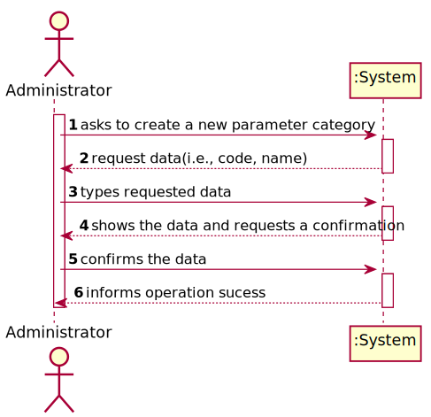
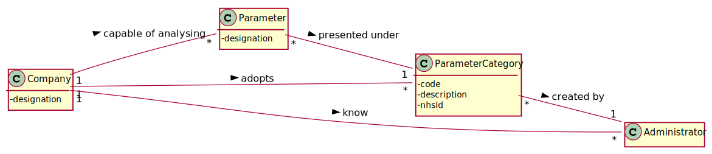
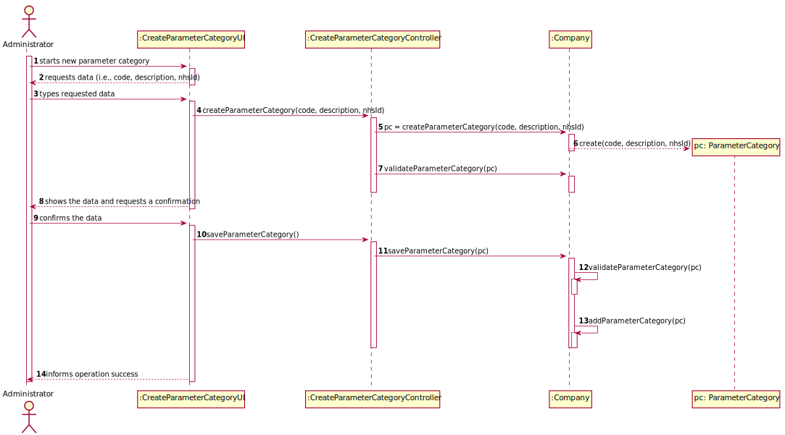
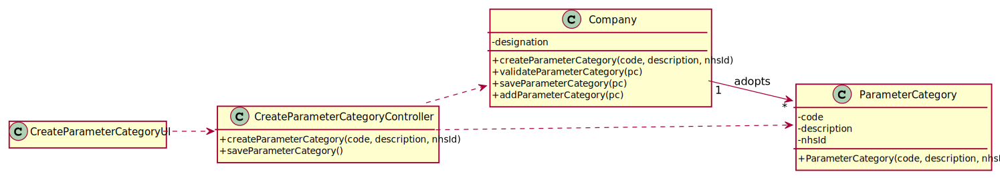

# US 11 - to specify a new parameter category

## 1. Requirements Engineering

### 1.1. User Story Description

As an administrator, I want to specify a new parameter category.

### 1.2. Customer Specifications and Clarifications 

**From the specifications document:**

> “Blood tests are frequently characterized by measuring several parameters which for presentation/reporting purposes are organized by categories. For example, parameters such as the number of Red Blood Cells (RBC), White Blood Cells (RBC) and Platelets (PLT) are usually presented under the blood count (Hemogram) category.”

> “Regardless, such tests rely on measuring one or more parameters that can be grouped/organized by categories.”

**From the client clarifications:**

> **Question:** "What are the information related to a Parameter Category?"
> 
> **Answer:** "Each category has a name and a unique code. There are no subcategories."

>Read the whole answer [here](https://moodle.isep.ipp.pt/mod/forum/discuss.php?d=7318#p9859).

> **Question:** "You have said in a previous post that each category has a name and an unique code. What specifies each of those? How many characters composes a name and a code for a test type category, for example?"
> 
> **Answer:** "The format of the attributes of one category are:
               Name: is a string with no more than 10 characters;
               Code: are five alphanumeric characters. The code is unique and is not automatically generated.
               Both attributes are mandatory.
               There are no subcategories."

>Read the whole answer [here](https://moodle.isep.ipp.pt/mod/forum/discuss.php?d=7898).

### 1.3. Acceptance Criteria

* **AC1:** Code is mandatory, unique and must have 5 alphanumeric characters.
* **AC2:** Name is a string with at maximum 10 characters.

### 1.4. Found out Dependencies

* No dependencies were found.

### 1.5 Input and Output Data

**Input Data:**

* Typed data:
	* code
	* name
	
* Selected data:
	* (none)

**Output Data:**

* (In)Sucess of the operation

### 1.6. System Sequence Diagram (SSD)

### 1.7 Other Relevant Remarks

*Use this section to capture other relevant information that is related with this US such as (i) special requirements ; (ii) data and/or technology variations; (iii) how often this US is held.* 

## 2. OO Analysis

### 2.1. Relevant Domain Model Excerpt 

### 2.2. Other Remarks

*Use this section to capture some aditional notes/remarks that must be taken into consideration into the design activity. In some case, it might be usefull to add other analysis artifacts (e.g. activity or state diagrams).* 

## 3. Design - User Story Realization 

### 3.1. Rationale

**The rationale grounds on the SSD interactions and the identified input/output data.**

| Interaction ID | Question: Which class is responsible for... | Answer  | Justification (with patterns)  |
|:-------------  |:--------------------- |:------------|:---------------------------- |
| Step 1: asks to create a new parameter category |	... interacting with the actor? | CreateParameterCategoryUI | Pure Fabrication: there is no reason to assign this responsibility to any existing class in the Domain Model. |
|       	   	 |	... coordinating the US? | CreateParameterCategoryController | Controller |
|       	   	 |	... instantiating a new Parameter Category? | Administrator | Creator: in the DM Company adopts a Parameter Category. |
|       	   	 |	... knowing the user using the system? | UserSession | According to A&A component documentation. |
| Step 2: request data(i.e., code, name) |	...asking the user for this data? | CreateParameterCategoryUI | IE: Responsable for user interaction. |
| Step 3: types requested data | ...validating the input data locally? | ParameterCategory | IE: Knows its own data. |
|                | ...saving the input data? | ParameterCategory | IE: It has its own data. |
| Step 4: shows the data and requests a confirmation | ...showing the data and requesting a confirmation? | CreateParameterCategoryUI | IE: responsible for user interaction |
| Step 5: confirms the data |	... validating the data globally (e.g.: duplicated)? | ParameterCategoryStore | IE: knows all the ParameterCategory objects |
|       	   	 |	...saving the created parameter category? | ParameterCategoryStore | IE: adopts/records all the ParameterCategory objects |
| Step 6: informs operation success |	... informing operation success? | CreateParameterCategoryUI | IE: responsible for user interaction |
### Systematization ##

According to the taken rationale, the conceptual classes promoted to software classes are: 

 * Administrator
 * Company
 * ParameterCategory

Other software classes (i.e. Pure Fabrication) identified: 
 * CreateParameterCategoryUI  
 * CreateParameterCategoryController

## 3.2. Sequence Diagram (SD)

## 3.3. Class Diagram (CD)

# 4. Tests 
*In this section, it is suggested to systematize how the tests were designed to allow a correct measurement of requirements fulfilling.* 

**_DO NOT COPY ALL DEVELOPED TESTS HERE_**

**Test 1:** Check that it is not possible to create an instance of the Example class with null values. 

	@Test(expected = IllegalArgumentException.class)
		public void ensureNullIsNotAllowed() {
		Exemplo instance = new Exemplo(null, null);
	}

*It is also recommended to organize this content by subsections.* 

# 5. Construction (Implementation)

*In this section, it is suggested to provide, if necessary, some evidence that the construction/implementation is in accordance with the previously carried out design. Furthermore, it is recommeded to mention/describe the existence of other relevant (e.g. configuration) files and highlight relevant commits.*

*It is also recommended to organize this content by subsections.* 

# 6. Integration and Demo 

*In this section, it is suggested to describe the efforts made to integrate this functionality with the other features of the system.*

# 7. Observations

*In this section, it is suggested to present a critical perspective on the developed work, pointing, for example, to other alternatives and or future related work.*

