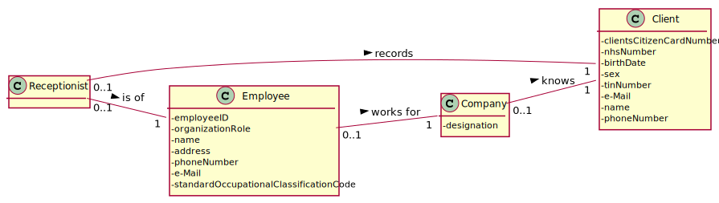
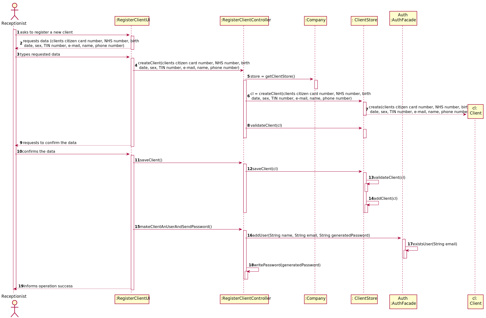

# US 003 - To register a new Client

## 1. Requirements Engineering

### 1.1. User Story Description

As a receptionist of the laboratory, I want to register a client.

### 1.2. Customer Specifications and Clarifications 

**From the specifications document:**

>	In case of a new client, the receptionist registers the client in the application. To register a client, the receptionist needs the client’s citizen card number, National Healthcare Service (NHS) number, birth date, sex, Tax Identification number (TIF), phone number, e-mail and name.

**From the client clarifications:**

> **Question:** "Are all the fields required/mandatory?"
>  
> **Answer:** "The phone number is opcional. All other fields are required."

-

> **Question:**  Which type/format should all data have?"
>  
> **Answer:** "Citizen Card" - 16 digit number; "NHS" - 10 digit number; "TIN" - 10 digit number; "Birth day - in which format?" - DD/MM/YY; "Sex - should only be Male/Female or include more options." -  Male/Female; "Phone number: which lenght/format?" - 11 digit number

-

> **Question:** "Since the client will become a system user, how should his password be generated ?"
>  
> **Answer:** 

### 1.3. Acceptance Criteria

* **AC1:** The client must become a system user. The "auth" component
available on the repository must be reused (without modifications);
* **AC2:** The Citizen Card must have 16 digit number;
* **AC3:** The NHS number must have 10 digit;
* **AC4:** The TIN number must have 10 digit;
* **AC5:** The Birth day format must be DD/MM/YY;
* **AC6:** The Sex options must be Male/Female;
* **AC7:** The Phone number must be 11 digit;
* **AC8:** The phone number is opcional. All other fields are required.

### 1.4. Found out Dependencies

* There is a dependency to "US7 Register a new employee" since the receptionist must be registered in the application and do the login so he can register the client.

### 1.5 Input and Output Data

**Input Data:**

* Typed data:
	* a clients citizen card number;
	* a NHS number;
	* a birth date;
	* the Sex;
	* a Tax Identification Number (TIN);
	* an e-mail;
    * a name;
    * a phone number (optional);

**Output Data:**

* (In)Success of the operation

### 1.6. System Sequence Diagram (SSD)

**Other alternatives might exist.**

### 1.7 Other Relevant Remarks

n/a

## 2. OO Analysis

### 2.1. Relevant Domain Model Excerpt 

### 2.2. Other Remarks

n/a

## 3. Design - User Story Realization 

### 3.1. Rationale

**SSD - Alternative 1 is adopted.**

| Interaction ID | Question: Which class is responsible for... | Answer  | Justification (with patterns)  |
|:-------------  |:--------------------- |:------------|:---------------------------- |
| Step 1  		 |	... interacting with the actor? | RegisterClientUI   |  Pure Fabrication: there is no reason to assign this responsibility to any existing class in the Domain Model.           |
| 			  		 |	... coordinating the US? | RegisterClientController | Controller                             |
|Step 2: starts new Client | ... instanting a new Client ? | Company | Creator: R1/2|
|Step 3: resquest data | ... n/a | | |
|Step 4: types requested data ? | ... saving the input data ?| Client | IE: The object created in step 2 has its own data|
|Step 5: showns the data and requests a confirmation | ... validating the data locally ? | Client| IE: knows its own data |
| | validating the data globally | Company | IE: knows all the Client objects|
|Step 6: confirms data | ... saving the created client ? | Company | IE: adopts/records all the Clients objects|
|Step 7| ... making the client a user of the system ? | UserSession | IE: cf. A&A component documentation.|
|Step 8: informs operation success| ... informing operation success ?| UI| IE:responsible for user interactions |

### Systematization ##

According to the taken rationale, the conceptual classes promoted to software classes are: 

 * Client;
 * Company

Other software classes (i.e. Pure Fabrication) identified: 

 * RegisterClientUI  
 * RegisterClientController

## 3.2. Sequence Diagram (SD)

**Alternative 1**

## 3.3. Class Diagram (CD)

**From alternative 1**

# 4. Tests 

**Test 1:** Check that it is not possible to create an instance of the Task class with null values. 

	@Test(expected = IllegalArgumentException.class)
		public void ensureNullIsNotAllowed() {
		Task instance = new Task(null, null, null, null, null, null, null);
	}
	

**Test 2:** Check that it is not possible to create an instance of the Task class with a reference containing less than five chars - AC2. 

	@Test(expected = IllegalArgumentException.class)
		public void ensureReferenceMeetsAC2() {
		Category cat = new Category(10, "Category 10");
		
		Task instance = new Task("Ab1", "Task Description", "Informal Data", "Technical Data", 3, 3780, cat);
	}

*It is also recommended to organize this content by subsections.* 

# 5. Construction (Implementation)

## Class CreateTaskController 

		public boolean createTask(String ref, String designation, String informalDesc, 
			String technicalDesc, Integer duration, Double cost, Integer catId)() {
		
			Category cat = this.platform.getCategoryById(catId);
			
			Organization org;
			// ... (omitted)
			
			this.task = org.createTask(ref, designation, informalDesc, technicalDesc, duration, cost, cat);
			
			return (this.task != null);
		}

## Class Organization

		public Task createTask(String ref, String designation, String informalDesc, 
			String technicalDesc, Integer duration, Double cost, Category cat)() {
		
	
			Task task = new Task(ref, designation, informalDesc, technicalDesc, duration, cost, cat);
			if (this.validateTask(task))
				return task;
			return null;
		}

# 6. Integration and Demo 

* A new option on the Employee menu options was added.

* Some demo purposes some tasks are bootstrapped while system starts.

# 7. Observations

Platform and Organization classes are getting too many responsibilities due to IE pattern and, therefore, they are becoming huge and harder to maintain. 

Is there any way to avoid this to happen?

