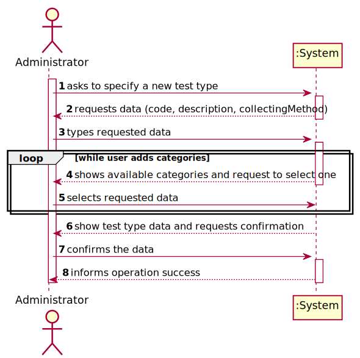
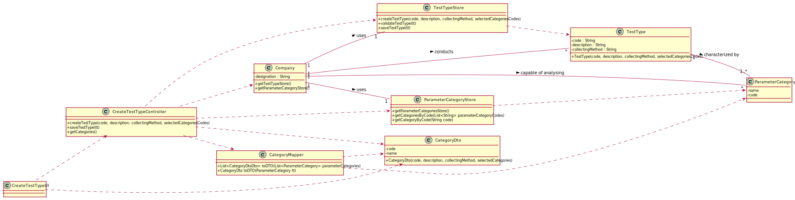

# US 9 - As an administrator, I want to specify a new type of test and its collecting methods

## 1. Requirements Engineering

*In this section, it is suggested to capture the requirement description and specifications as provided by the client as well as any further clarification on it. It is also suggested to capture the requirements acceptance criteria and existing dependencies to other requirements. At last, identfy the involved input and output data and depicted an Actor-System interaction in order to fulfill the requirement.*

### 1.1. User Story Description

As an ***administrator***, I want to specify a **new type of test** and its **collecting methods**

### 1.2. Customer Specifications and Clarifications 

**From the specifications document:**
>"Once there, a receptionist asks the client’s citizen card number, the lab order (which
 **contains the type of test** and parameters to be measured)"
>
>"Despite being out of scope, the system should be developed having in mind the **need to
 easily support other kinds of tests (e.g., urine)**. Regardless, such tests rely on measuring one
 or more parameters that can be grouped/organized by categories."

**From the client clarifications:**
>Q1: Does a type of test holds any atributte besides it's name and collecting methods?
>
>A1:The attributes for a new test type are:
    Code: five alphanumeric characters. The code is not automatically generated.
    Description: a string with no more than 15 characters.
    Collecting Method: a string with no more than 20 characters.
    Each test type should have a set of categories. Each category should be chosen from a list of categories.
    From a previous post: "Each category has a name and a unique code. There are no subcategories."
>   There exists only one collection method per test type.
>
>Q2: Are the collecting methods stored simpled as a word or a sentence, or does it also must contain it's description, and/or another attributes?
>
>A2:From a previous post: "To make a Covid test you need a swab to collect a sample. To make a blood test you need sample tubes and a syringe.
    When the administrator (US9) specifies a new type of test, the administrator also specifies the method to collect a sample. The administrator introduces a brief description for specifying the collecting method. "
>   There exists only one collection method per test type.
>
>Question 1 and 2 link [here](https://moodle.isep.ipp.pt/mod/forum/discuss.php?d=7507).
>
>Q3: "In the US9 what do you mean by the collecting methods and  what collecting methods  are available??"
>
>A3: "To make a Covid test you need a swab to collect a sample. To make a blood test you need sample tubes and a syringe. 
>When the administrator (US9) specifies a new type of test, the administrator also specifies the method to collect a sample. The administrator introduces a brief description for each collecting method."
>
>Question 3 link [here](https://moodle.isep.ipp.pt/mod/forum/discuss.php?d=7752).
>
>Q4: "US9- Analog to US8 do you have any acceptance criteria you want to introduce in US9?"
>
>A4: "For now I have nothing more to say about the acceptance criteria of US9."
>
>Question 4 link [here](https://moodle.isep.ipp.pt/mod/forum/discuss.php?d=7744).

### 1.3. Acceptance Criteria

* **AC1:** The code must have 5 alphanumeric characters
* **AC2:** Description must be a string with no more than 15 characters.
* **AC3:** Collecting Method must be a string with no more than 20 characters.
* **AC4:** Each test type should have a set of categories chosen from a list of categories.
* **AC5:** Every test type must have one collecting method.

### 1.4. Found out Dependencies

There is a dependency to "US 11 - to specify a new parameter category" since the test type must be associated with at least one Category

### 1.5 Input and Output Data

* Typed data:
    * Code
    * Description
    * Collecting method
* Selected data:
    * Categories
### 1.6. System Sequence Diagram (SSD)

*Insert here a SSD depicting the envisioned Actor-System interactions and throughout which data is inputted and outputted to fulfill the requirement. All interactions must be numbered.*

### 1.7 Other Relevant Remarks

*Use this section to capture other relevant information that is related with this US such as (i) special requirements ; (ii) data and/or technology variations; (iii) how often this US is held.* 

## 2. OO Analysis

### 2.1. Relevant Domain Model Excerpt 
*In this section, it is suggested to present an excerpt of the domain model that is seen as relevant to fulfill this requirement.* 

### 2.2. Other Remarks

*Use this section to capture some aditional notes/remarks that must be taken into consideration into the design activity. In some case, it might be usefull to add other analysis artifacts (e.g. activity or state diagrams).* 

## 3. Design - User Story Realization 

### 3.1. Rationale

**The rationale grounds on the SSD interactions and the identified input/output data.**

| Interaction ID | Question: Which class is responsible for... | Answer  | Justification (with patterns)  |
|:-------------  |:--------------------- |:------------|:---------------------------- |
| Step 1: Asks to specify a new test type	                          |	        ... instantiating a new test type?				                        | Test Type Store             | Creator: R1/2                                        |
| Step 2: Request test type data(code, description, collectingMethod) |			n/a				                                                        |                             |                                                      |
| Step 3: Types requested data		                                  |			...saving input data?				                                    | Test Type                   | IE: The object created in step 1 has its own data.   |
| Step 4: Shows available categories and request to select one or more|			n/a				                                                        |                             |                                                      |              
| Step 5: Selects requested data                                      |          ...saving the input data?				                                | Test Type                   | IE: Object created in step 1 has a set of categories.|         
| Step 6: Shows test type data and requests confirmation              |			… validating the data locally (e.g.: mandatory vs. non-mandatory data)? | Test Type                   | IE: Knows its own data.                              |              
|                                                                     |          … validating the data globally (e.g.: duplicated)?				        | Test Type Store             | IE: Knows all Test Type objects.                     |              
| Step 7: Confirms data                                               |			... saving the created test type?				                        | Test Type Store             | IE: Records/adopts all the Test Type objects.        |              
| Step 8: Informs operation success                                   |			... informing operation success?				                        | UI                          | IE: responsible for user interaction                 |              

### Systematization ##

According to the taken rationale, the conceptual classes promoted to software classes are: 

 * TestType
 * Company
 * Administrator
 * ParameterCategory

Other software classes (i.e. Pure Fabrication) identified: 
 * CreateTestTypeUI  
 * CreateTestTypeController

## 3.2. Sequence Diagram (SD)

*In this section, it is suggested to present an UML dynamic view stating the sequence of domain related software objects' interactions that allows to fulfill the requirement.* 

## 3.3. Class Diagram (CD)

*In this section, it is suggested to present an UML static view representing the main domain related software classes that are involved in fulfilling the requirement as well as and their relations, attributes and methods.*

# 4. Tests 
*In this section, it is suggested to systematize how the tests were designed to allow a correct measurement of requirements fulfilling.* 

**_DO NOT COPY ALL DEVELOPED TESTS HERE_**

###4.1 TestType instances values:
**Test 1:** Check that it is not possible to create an instance of the TestType class with null values. 

	@Test(expected = IllegalArgumentException.class)
		public void ensureNullIsNotAllowed() {
		Exemplo instance = new Exemplo(null, null);
	}
**Test 2:** Check that it is not possible to create an instance of the TestType class with code being an empty String.	
	
**Test 3:** Check that it is not possible to create an instance of the TestType class with code holding more than 5 characters.  

**Test 4:** Check that it is not possible to create an instance of the TestType class with code holding less than 5 characters. 
	
**Test 5:** Check that it is not possible to create an instance of the TestType class with code holding not alphanumeric characters. 

**Test 6:** Check that it is not possible to create an instance of the TestType class with description holding more than 15 characters. 

**Test 7:** Check that it is not possible to create an instance of the TestType class with description being an empty String.

**Test 8:** Check that it is not possible to create an instance of the TestType class with collecting method holding more than 20 characters. 

**Test 9:** Check that it is not possible to create an instance of the TestType class with collecting method being an empty String.

##4.2 TestTypeStore

**Test 10:** Check that it is not possible to save a repeated Test Type in the store
* Same Object
* Different Object, same code

**Test 11:** Check that it is not possible to save a null Test Type in the store

**Test 12:** Check that it is not possible to get the test types by code with not assigned codes 

*It is also recommended to organize this content by subsections.* 

# 5. Construction (Implementation)

*In this section, it is suggested to provide, if necessary, some evidence that the construction/implementation is in accordance with the previously carried out design. Furthermore, it is recommeded to mention/describe the existence of other relevant (e.g. configuration) files and highlight relevant commits.*

*It is also recommended to organize this content by subsections.* 

# 6. Integration and Demo 

*In this section, it is suggested to describe the efforts made to integrate this functionality with the other features of the system.*

# 7. Observations

*In this section, it is suggested to present a critical perspective on the developed work, pointing, for example, to other alternatives and or future related work.*

