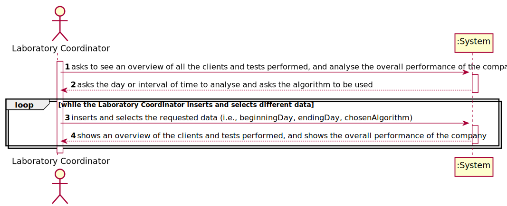
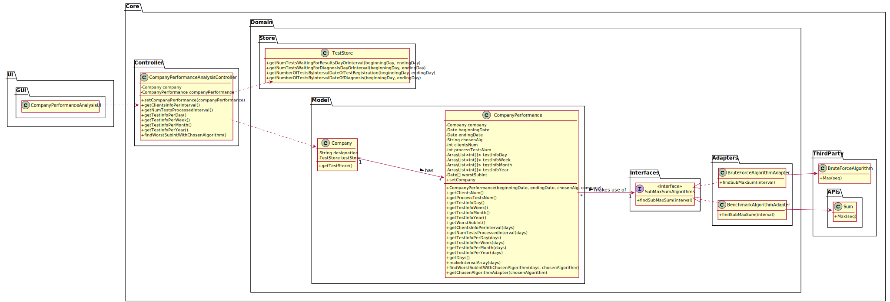
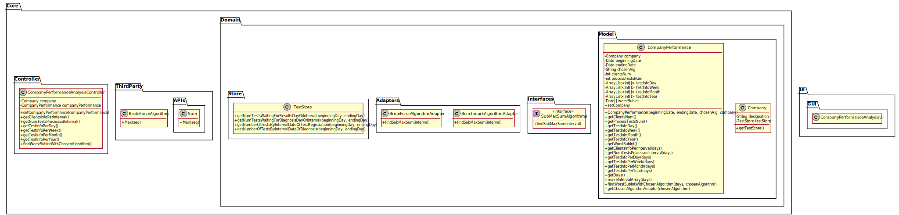

# US 16 - have an overview of all the tests and analyse the company performance

## 1. Requirements Engineering

### 1.1. User Story Description

As a laboratory coordinator, I want to have an overview of all the tests performed
by Many Labs and analyse the overall performance of the company (for instance, check
the sub-intervals in which there were more samples waiting for the result). To facilitate
overall analysis, the application should also display statistics and graphs.

### 1.2. Customer Specifications and Clarifications

**From the specifications document:**

> 

**From the client clarifications:**

> **Question:**
>
> **Answer:** 

>Read the whole answer [here]().

-

### 1.3. Acceptance Criteria

* **AC1:** While evaluating the performance the laboratory 
  coordinator should have the ability to dynamically select the algorithm to be
  applied from the ones available on the system (the benchmark algorithm provided
  in moodle and the brute-force algorithm to be developed).
* **AC2:** Support for easily adding other similar algorithms is required.

### 1.4. Found out Dependencies

* There is a dependency to "USX: XXX" since xxxxx.

### 1.5 Input and Output Data

**Input Data:**

* Typed data:
    * 

* Selected data:
    * 

**Output Data:**

* 
* (In)Sucess of the operation

### 1.6. System Sequence Diagram (SSD)

### 1.7 Other Relevant Remarks

The present US is held many times during the business. As the Company works in the analysis/testing field, it's crucial xxxxxx.

## 2. OO Analysis

### 2.1. Relevant Domain Model Excerpt

### 2.2. Other Remarks

n/a

## 3. Design - User Story Realization

### 3.1. Rationale

**The rationale grounds on the SSD interactions and the identified input/output data.**

| Interaction ID | Question: Which class is responsible for... | Answer  | Justification (with patterns)  |
|:-------------  |:--------------------- |:------------|:---------------------------- |
| Step 1: aaa |	... aaa? | AaA | aaa. |
| | ... aaa? | AaA | aaa. |

### Systematization ##

According to the taken rationale, the conceptual classes promoted to software classes are:

* 
* 

Other software classes (i.e. Pure Fabrication) identified:
* 
* 

## 3.2. Sequence Diagram (SD)

### 3.2.1 Sequence Diagram

### 3.2.2 Partial Sequence Diagram I

...

## 3.3. Class Diagram (CD)

### 3.3.1 Class Diagram

### 3.3.2 Class Diagran With Packages

## 3.4. Package Diagram (PD)

### 3.4.1 Package Diagram With Associations

### 3.4.2 Package Diagram

# 4. Tests

# 4.1 Report

# 5. Construction (Implementation)

# 6. Integration and Demo

# 7. Observations

