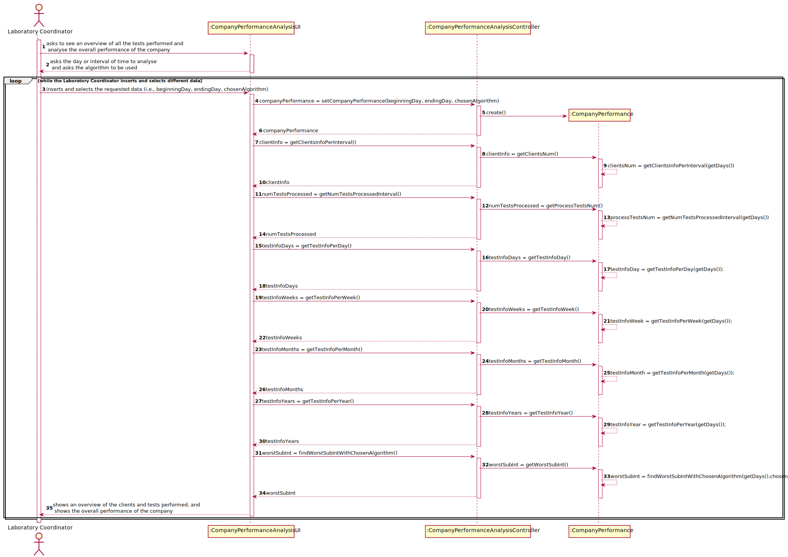
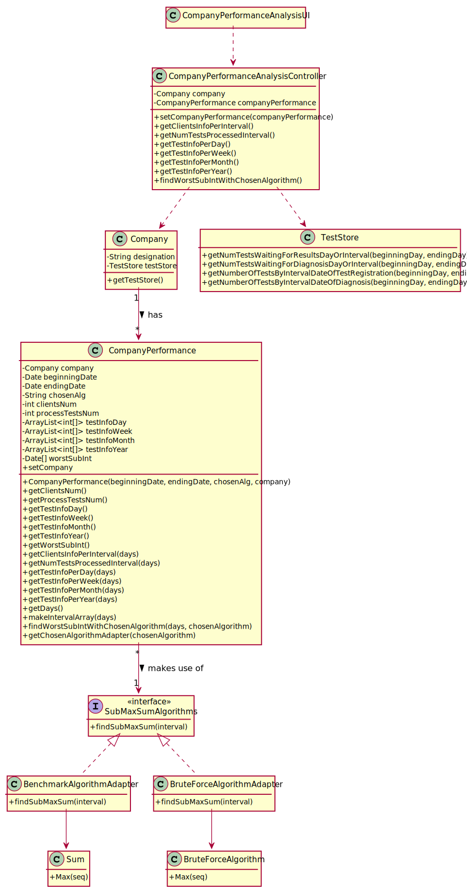
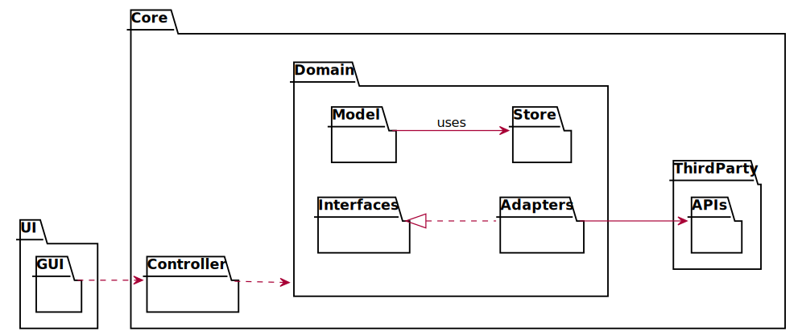

# US 16 - have an overview of all the tests and analyse the company performance

## 1. Requirements Engineering

### 1.1. User Story Description

As a laboratory coordinator, I want to have an overview of all the tests performed
by Many Labs and analyse the overall performance of the company (for instance, check
the sub-intervals in which there were more samples waiting for the result). To facilitate
overall analysis, the application should also display statistics and graphs.

### 1.2. Customer Specifications and Clarifications

**From the specifications document:**

> "...the company wants to decrease the number of tests waiting for its result. To evaluate this, it proceeds as following: for
any interval of time, for example one week (6 working days with 12 working hours per day), the difference between the number 
of new tests and the number of results available to the client during each half an hour period is computed . In that case, 
a list with 144 integers is obtained, where a positive integer means that in such half an hour more tests were processed 
than results were obtained, and a negative integer means the opposite. Now, the problem consists in determining what
the contiguous subsequence of the initial sequence is, whose sum of their entries is maximum. 
This will show the time interval, in such week, when the company was less effective in responding."

> "So, the application should implement a brute force algorithm (an algorithm which examines each
subsequence) to determine the contiguous subsequence with maximum sum, for any interval of time
registered. The implemented algorithm should be analysed in terms of its worst complexity, and it 
should be compared to a provided benchmark algorithm . The algorithm to be used by the application must be 
defined through a configuration file."

> "The complexity analysis must be accompanied by the observation of the execution time of the
algorithms for inputs of variable size in order to observe the asymptotic behaviour. The time
complexity analysis of the algorithms should be properly documented in the application user
manual (in the annexes) that must be delivered with the application."

**From the client clarifications:**

> **Question:** Should the interval of time considered for the evaluation be asked to the Laboratory Coordinator?
>
> **Answer:** Yes.

>Read the whole answer [here](https://moodle.isep.ipp.pt/mod/forum/discuss.php?d=8831#p11592).

-

> **Question:** How should we ask him the interval of time to be considered? Should we ask him to type a number of days? A number of weeks? Should we give general options like: last week, last month..., for him to select from?
>
> **Answer:** The laboratory coordinator should introduce two dates that define an interval, the beginning date and the end date. This interval will be used to find the contiguous subsequence with maximum sum.

>Read the whole answer [here](https://moodle.isep.ipp.pt/mod/forum/discuss.php?d=8831#p11592).

-

> **Question:** What is the meaning of "overview" here? Should the laboratory coordinator see the number of tests waiting for samples, the number of tests waiting for results, the number of tests waiting for diagnoses... Or should he see the information available for each one of the tests in the application?
>
> **Answer:** The laboratory coordinator should be able to check the number of clients, the number of tests waiting for results, the number of tests waiting for diagnosis and the total number of tests processed in the laboratory in each day, week, month and year. Moreover, the laboratory coordinator should be able to check the contiguous subsequence with maximum sum.

>Read the whole answer [here](https://moodle.isep.ipp.pt/mod/forum/discuss.php?d=8831#p11592).

### 1.3. Acceptance Criteria

* **AC1:** To facilitate overall analysis, the application should display 
  statistics and graphs.
* **AC2:** While evaluating the performance the laboratory 
  coordinator should have the ability to dynamically select the algorithm to be
  applied from the ones available on the system (the benchmark algorithm provided
  in moodle, and the brute-force algorithm to be developed).
* **AC3:** Support for easily adding other similar algorithms is required.

### 1.4. Found out Dependencies

* There is a dependency to "US4: As a receptionist of the laboratory, I intend to 
  register a test to be performed to a registered client." since the app needs to have 
  tests in it, so that the company can have a performance and the Laboratory Coordinator 
  can have an overview of the company tests.

### 1.5 Input and Output Data

**Input Data:**

* Typed data:
    * interval of time to be analysed

* Selected data:
    * algorithm to use

**Output Data:**

* overview of all the tests performed
* overall performance of the company

### 1.6. System Sequence Diagram (SSD)

### 1.7 Other Relevant Remarks

The present US is held many times during the business. As the Company wants to decrease 
the number of tests waiting for its result, it's crucial for the Laboratory Coordinator 
to frequently have an overview of all the tests performed and analyse the overall 
performance of the company. In this way, he can find the days when the company 
performance was less effective and figure out the cause of it.

## 2. OO Analysis

### 2.1. Relevant Domain Model Excerpt

### 2.2. Other Remarks

n/a

## 3. Design - User Story Realization

### 3.1. Rationale

**The rationale grounds on the SSD interactions and the identified input/output data.**

| Interaction ID | Question: Which class is responsible for... | Answer  | Justification (with patterns)  |
|:-------------  |:--------------------- |:------------|:---------------------------- |
| Step 1: asks to see an overview of all the tests performed and analyse the overall performance of the company |	... interacting with the actor? | CompanyPerformanceAnalysisUI | Pure Fabrication: there is no reason to assign this responsibility to any existing class in the Domain Model. |
| | ... coordinating the US? | CompanyPerformanceAnalysisController | Controller |
| Step 2: shows an overview of all the tests performed and asks the interval of time to be analysed | ... knowing the test info to show? | TestStore | Pure Fabrication: for coupling reasons. There is no reason to assign this responsibility to any existing class in the Domain Model. |
| | ... knowing client info to show? | ClientStore | Pure Fabrication: for coupling reasons. There is no reason to assign this responsibility to any existing class in the Domain Model. |
| | ... knowing the TestStore? | Company | Pure Fabrication: Company knows the TestStore |
| | ... asking the user for this data? | CompanyPerformanceAnalysisUI | IE: is responsible for user interactions. |
| Step 3: types requested data | ... saving the inputted data? | CompanyPerformanceAnalysis | IE: Company Performance Analysis had its own data. |
| Step 4: shows the overall performance of the company for the chosen interval of time (e.g worstSubInt, statistics, graphs) | ... knowing the data to show? | CompanyPerformanceAnalysis | IE: Company Performance Analysis had its own data. |

### Systematization ##

According to the taken rationale, the conceptual classes promoted to software classes are:

* CompanyPerformanceAnalysis
* Company

Other software classes (i.e. Pure Fabrication) identified:
* CompanyPerformanceAnalysisController
* CompanyPerformanceAnalysisUI
* TestStore
* ClientStore

## 3.2. Sequence Diagram (SD)

## 3.3. Class Diagram (CD)

### 3.3.1 Class Diagram

### 3.3.2 Class Diagran With Packages

## 3.4. Package Diagram (PD)

### 3.4.1 Package Diagram With Associations

### 3.4.2 Package Diagram

# 4. Tests

# 5. Construction (Implementation)

# 6. Integration and Demo

# 7. Observations

n/a