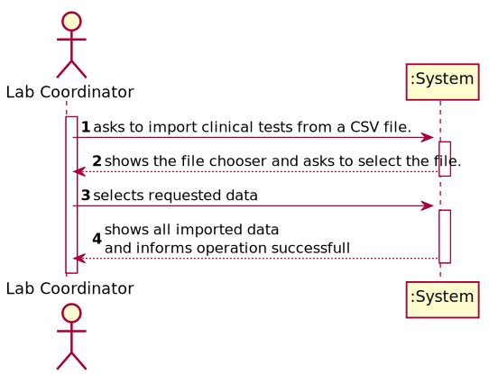
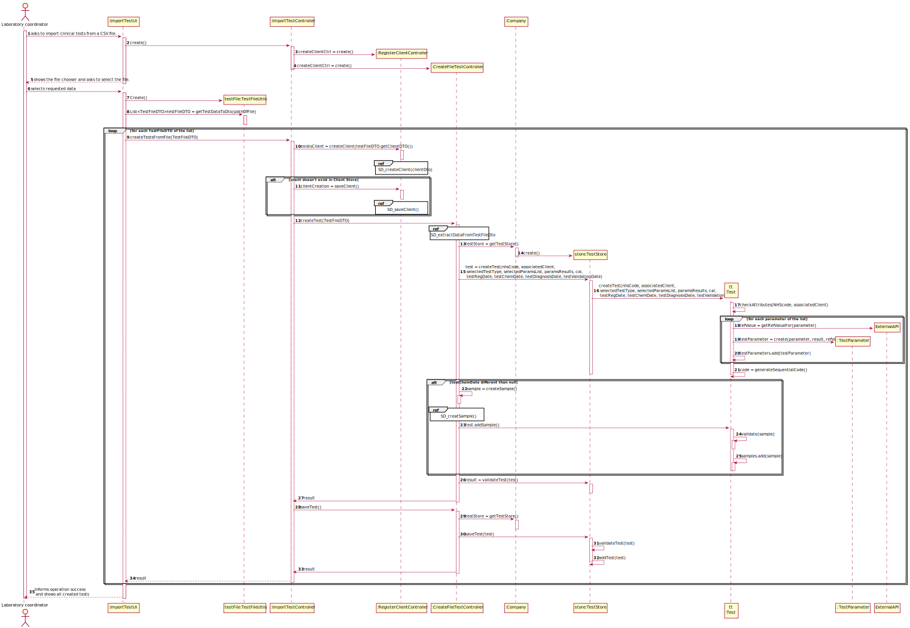
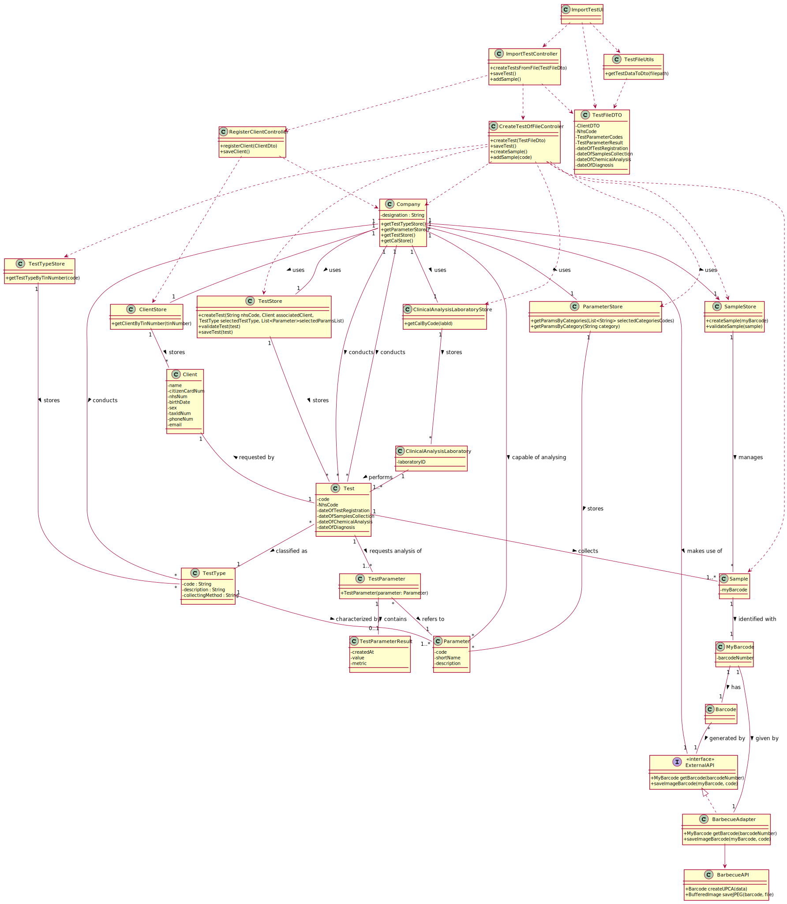

# US 17 - As a laboratory coordinator, I want to import clinical tests from a CSV file.

## 1. Requirements Engineering

### 1.1. User Story Description

As a **laboratory coordinator**, I want to import **clinical tests** from a CSV file.

### 1.2. Customer Specifications and Clarifications 

 **From the client clarifications:**
 
 delegate with other controllers, read file in UI, full constructor
 
 >Q1: Will the CSV files always have the same format as the ones available on moodle?
 >
 >A1: Yes. But we can have more categories and parameters for each type of test.
>
>Q1 Link [here](https://moodle.isep.ipp.pt/mod/forum/discuss.php?d=8883).
>
>Q2: If some kind of data is wrong, what should happen should we just ignore the line where it is located?
>
>A2: The application should not load tests that have incorrect attribute values. The application should identify the tests that have incorrect values and it should continue loading all valid tests that exist in the file. A message should be sent to the console to identify the tests/lines that have incorrect values.
>
>Q2 Link [here](https://moodle.isep.ipp.pt/mod/forum/discuss.php?d=8960).
>
>Q3: Should we show the data that the laboratory coordinator is importing?
>
>A3:  Yes, it should show all the data that was imported at that time.
>
>Q3 Link [here](https://moodle.isep.ipp.pt/mod/forum/discuss.php?d=8883).

### 1.3. Acceptance Criteria

* **AC1**: If the file contains invalid data (e.g., a parameter not defined in the system), that data should not be load into the system. An exception should be thrown.

### 1.4. Found out Dependencies

* There is a dependency with "US7 - To register a new employee" since the Laboratory coordinator must be registered in the system.
* There is a dependency with "US3 - To register a new client" since the system must be able to find or register a client.
* There is a dependency with "US4 - To register a new employee" since the system must be able to register a test.

### 1.5 Input and Output Data

* Selected data:
    * CSV file path

### 1.6. System Sequence Diagram (SSD)

### 1.7 Other Relevant Remarks

The present US may not be used frequently since the all tests are supposed to be registered before being conducted.

## 2. OO Analysis

### 2.1. Relevant Domain Model Excerpt 

### 2.2. Other Remarks

n/a

## 3. Design - User Story Realization 

### 3.1. Rationale

**The rationale grounds on the SSD interactions and the identified input/output data.**

| Interaction ID | Question: Which class is responsible for... | Answer  | Justification (with patterns)  |
|:-------------  |:--------------------- |:------------|:----------------------------  |
| Step 1: asks to import clinical tests from a CSV file.                               |...Instantiating a new Test?                                                    | TestStore                         | Creator: R1|
|                                                                                      |...Instantiating a new Client(if needed)?                                       | ClientStore                       | Creator: R1|
|                                                                                      |...Coordinating the creation of a test?                                         | CreateTestController              | Pure Fabrication: The system already has a Controller class for this use case, promoting the reuse of it.|
|                                                                                      |...Coordinating the creation of a client(if needed)?                            | RegisterClientController          | Pure Fabrication: The system already has a Controller class for this use case, promoting the reuse of it.|
| Step 2: Shows the file chooser and asks to select the file.                          |  n/a                                                                           |                                   |                                              |
| Step 3: selects requested data                                                       |... process the requested data from the selected file?                          | TestFileUtils                     | Pure fabrication: to achieve high cohesion an artificial class that doesn't represent a domain concept may be created. |
|                                                                                      |... Knowing if the given client exists?                                         | ClientStore                       | IE: Knows all Client objects.|
|                                                                                      |... Saving the created test?	                                                | CreateTestController              | Controller: The test created by the controller must be saved by it.|
|                                                                                      |... Getting the created test by it's NHS number?                                | TestStore                         | IE: Knows all Test objects.|
|                                                                                      |... Updating the test results and dates?                                        | Test                              | Creator: the test has all it's attributes. |
| Step 4: informs operation success                                                    | ... informing operation success?                                               | ImportTestUI                      |IE: responsible for user interaction|   

### Systematization ##

According to the taken rationale, the conceptual classes promoted to software classes are: 

* Test
* Client

Other software classes (i.e. Pure Fabrication) identified: 

* TestFileUtils
* CreateTestController
* RegisterClientController
* TestStore
* ClientStore
* ImportTestUI

## 3.2. Sequence Diagram (SD)

*In this section, it is suggested to present an UML dynamic view stating the sequence of domain related software objects' interactions that allows to fulfill the requirement.* 

## 3.3. Packages Diagram - Low in details

### 3.4. Packages Diagram with classes

## 3.5. Class Diagram (CD)

# 4. Tests 
###4.1 Test instances values:

**Test 1:** Check that it is not possible to create an instance of the TestType class with null values. 

	@Test(expected = IllegalArgumentException.class)
    public void createTestWithNullParameters(){
        app.domain.model.Test test = new app.domain.model.Test(null, null, null, null);
    }
	
**Test 2:** Check if it's not possible to create a Test with empty field for each attribute.  
**For Example:**

    @Test(expected = IllegalArgumentException.class)
    public void createTestWithemptyNHScode(){
        Client client = new Client("1234567890123456", "1234567890", d1, "Male", "1234567890", "alex@gmail.com", "Alex", "12345678901");
        app.domain.model.Test test = new app.domain.model.Test("", client, t1, parametersBlood);
    }

 
**Test 3:** Check if it is not possible to create a Test with each attribute's lenght not following the specified criteria.
> * **AC3**: The NHS code must hold 12 alphanumeric digits.

**For Example:**

    @Test(expected = IllegalArgumentException.class)
    public void createTestWithMore12CharsNHScode(){
        Client client = new Client("1234567890123456", "1234567890", d1, "Male", "1234567890", "alex@gmail.com", "Alex", "12345678901");
        app.domain.model.Test test = new app.domain.model.Test("1234567890123", client, t1, parametersBlood);
    }

**Test 4:** Check if it is not possible to create a Test with NHS code containing non alphanumeric characteres

**Test 5:** Check if the auto generated code is sequencial and have 12 digits  
**For Example:**

    @Test //this test checks if the generated number is 12 digits long
    public void ensureCodeis12digits(){
        Client client = new Client("1234567890123456", "1234567890", d1, "Male", "1234567890", "alex@gmail.com", "Alex", "12345678601");
        app.domain.model.Test test = new app.domain.model.Test("123456789012", client, t1, parametersBlood);

        Assert.assertTrue(test.getCode().length() == 12);
    }
**Test 6:** Check if samples cannot be added as null  
**For Example:**

      @Test 
      public void ensureNotPossibleToAddNullSample() {
         TestStore testStore = new TestStore();
         Client client = new Client("1234567890123456", "1234567890", d1, "Male", "1234567890", "alex@gmail.com", "Alex", "12345678601");
         app.domain.model.Test test = testStore.createTest("123456789012", client, t1, parametersBlood);
 
         Assert.assertFalse(test.addSample(null));
      }
**Test 7:** Check if tests with of without samples are being evaluated correctly by hasSamples method

###4.1 Test Store:

**Test 8:** Check if it is not possible to add a test with being null

**Test 9:** Check if it is not possible to add two identical tests to the test store

**Test 10:** Check if tests with no samples are being found correctly  
**For Example:**

     public void ensureTestsWithNoSamplesAreFound(){
        TestStore testStore = new TestStore();
        Client client = new Client("1234567890123456", "1234567890", d1, "Male", "1234567890", "alex@gmail.com", "Alex", "12345678601");
        Client client2 = new Client("1234567890123458", "1234567890", d1, "Male", "1234567890", "alex1@gmail.com", "Alex", "12345675901");
        Client client3 = new Client("1234567890123457", "1234567890", d1, "Male", "1234567890", "alex3@gmail.com", "Alex", "12345688901");
        app.domain.model.Test test = testStore.createTest("123456789012", client, t1, parametersBlood);
        app.domain.model.Test test2 = testStore.createTest("123456789012", client2, t2, parametersCovid);
        app.domain.model.Test test3 = testStore.createTest("123456789012", client3, t1, parametersBlood);
        testStore.saveTest(test);
        testStore.saveTest(test2);
        testStore.saveTest(test3);

        Assert.assertEquals(testStore.getTestsWithNoSamples(), testStore.getTests());
    }
    
**Test 11:** Check if tests are being found by barcode number and by code

**Test 12:** Check if getting tests with not existent barcode numbers or codes are throwing exceptions

**Test 13:** Check if tests ready to be diagnosed are being evaluated correctly

*It is also recommended to organize this content by subsections.* 

# 5. Construction (Implementation)

## Class CreateTestController

    public boolean createTest(String nhsCode, String citizenCardNumber, String selectedTestTypeCode, List<String> selectedParamsCodes){
        TestStore testStore = this.company.getTestStore();
        ClientStore clientStore = this.company.getClientStore();
        TestTypeStore testTypeStore = this.company.getTestTypeStore();
        ParameterStore parameterStore = this.company.getParameterStore();

        Client associatedClient = clientStore.getClientByCitizenCardNum(citizenCardNumber);
        TestType testType = testTypeStore.getSingleTestTypeByCode(selectedTestTypeCode);
        List<Parameter> parameters = parameterStore.getParamsByCodes(selectedParamsCodes);

        this.test = testStore.createTest(nhsCode, associatedClient, testType, parameters);

        return testStore.validateTest(test);
    }

    //...Omitted
    
    public boolean saveTest() {
        TestStore testStore = this.company.getTestStore();
        return testStore.saveTest(test);
    }
    
## Class TestStore

    public Test createTest(String nhsCode, Client associatedClient, TestType testType, List<Parameter> parameters) {
        return new Test(nhsCode, associatedClient, testType, parameters);
    }

    //...Omitted
    
    public boolean validateTest(Test test) {
        if (test == null)
            return false;
        return !this.testList.contains(test);
    }

    public boolean saveTest(Test test) {
        if (!validateTest(test))
            return false;
        return this.testList.add(test);
    }

## Class Test

    public Test(String nhsCode, Client client, TestType testType, List<Parameter> parameters) {
        checkNhsCode(nhsCode);
        totalTests++;
        this.code = generateCode();
        this.nhsCode = nhsCode;
        this.client = client;
        this.testType = testType;
        this.testParameters = addTestParameters(parameters);
        this.samples = new ArrayList<>();
        this.dateOfTestRegistration = generateNowDateAndTime();
        this.diagnosisReport = null;
    }

    //...Omitted
    
    private String generateCode(){
        return String.format("%012d", totalTests);
    }
    
    private String generateNowDateAndTime(){
        SimpleDateFormat simpleDateFormat = new SimpleDateFormat("dd/MM/yyyy HH:mm");
        return simpleDateFormat.format(new Date());
    }
    
    private List<TestParameter> addTestParameters(List<Parameter> parameters){
        List<TestParameter> testParameters = new ArrayList<>();
        for(Parameter parameter : parameters){
            testParameters.add(new TestParameter(parameter));
        }
        return testParameters;
    }

# 6. Integration and Demo 

To create a Test several lists of existent participants of the system are needed, such as: TestTypes, ParameterCategories and Parameters. 
Therefore in order to reduce coupling all of those objects are passed to the UI layer through DTO's, with the assistance of Mappers for each to convert the data objects.

# 7. Observations

*In this section, it is suggested to present a critical perspective on the developed work, pointing, for example, to other alternatives and or future related work.*

