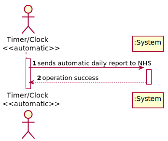
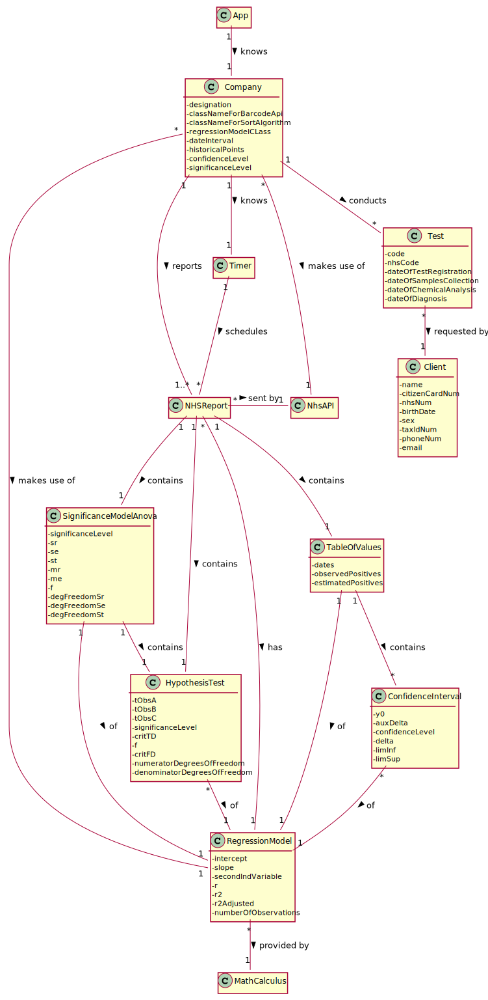

# US 019 - Send daily reports to NHS of Covid-19 data

## 1. Requirements Engineering

*In this section, it is suggested to capture the requirement description and specifications as provided by the client as well as any further clarification on it. It is also suggested to capture the requirements acceptance criteria and existing dependencies to other requirements. At last, identfy the involved input and output data and depicted an Actor-System interaction in order to fulfill the requirement.*

### 1.1. User Story Description

The Many Labs company wants to send to the NHS daily reports of Covid-19
data, including the number of observed values and estimated values. Reports should be
generated automatically with historical data and must be sent every day at 6:00 am.

### 1.2. Customer Specifications and Clarifications 

*Insert here any related specification and/or clarification provided by the client together with **your interpretation**. When possible, provide a link to such specifications/clarifications.*  

**From the specifications document:**  
>[…] NHS […] requires Many Labs to summarize and report Covid-19 data […]  identify the number of Covid-19 tests performed, identify all positive results to Covid-19 tests, **report the total number of Covid-19 cases per day, per week and per month of the year, and send the forecasts for these same time horizons (the number of Covid-19 cases for the following day, next week and next month). The company is also required to generate daily (automatic) reports with the information demanded by the NHS and should send them to the NHS using their API.**”  
> To make the predictions, the NHS contract defines that a linear regression algorithm should be used.  
> The NHS required that both simple linear and multiple linear regression algorithms should be
evaluated to select the best model. 
> The accuracy of the prediction models should be analysed and
documented in the application user manual (in the annexes) that must be delivered with the
application.  
> The algorithm to be used by the application must be defined through a configuration
file.  

**From the client clarifications:**  
> **Q:** I would like to know if will be given a Multiple Linear Regression Class to work, or should it be developed by the groups?  
> **A:** **The Multiple Linear Regression Class should be developed by each team**. In moodle I made available a Java file with Simple Linear Regression.
The teams should not use libraries or other external modules to implement linear regression.  

You can read the whole dicussion [here](https://moodle.isep.ipp.pt/mod/forum/discuss.php?d=8836).

### 1.3. Acceptance Criteria

**AC1:** The report should include:  
 * day and week (observed and estimated) values;  
 * the regression model used to estimate each value;  
 * R(SLR), R2 and R2 adjusted for SLR and MLR;  
 * hypothesis tests for regression coefficients significance model with Anova.  

**AC2:** Simple linear and multilinear regression models can be used to compute the estimates and corresponding confidence intervals. 

**AC3:** When the system is configured to use the simple linear regression model, **the performance of each model should be used to select the best model** (the one that uses the number of tests realized OR the one that uses the mean age as independent variable). **The best model will be used to make the estimated/expected values that will be send to NHS.** 

**AC4:** The **interval of dates to fit the regression model** and the **number of historical points** (number of days and number of weeks) must be defined through a configuration file. 

**AC5:** **The system should send the report using the NHS API (available in moodle).**  

**AC6:** To **find the critical values for the t-student and Fisher–Snedecor distributions** it should be used the Apache Commons Math Library, version 3.5.  

   

### 1.4. Found out Dependencies

There is a dependency to:

* **"US004 Register a test to be performed to a registered client"**  
* **"US012 Record the results of a given test**  
* **"US017 Import clinical tests from a CSV file"**

Since all the performed tests **with results** by Many Labs must be recorded in the system in order to send accurate data and forecasts to NHS.

### 1.5 Input and Output Data

**Input Data:**

* Report data

**Output Data:**

* File "NHSReport.txt"

### 1.6. System Sequence Diagram (SSD)

*Insert here a SSD depicting the envisioned Actor-System interactions and throughout which data is inputted and outputted to fulfill the requirement. All interactions must be numbered.*

### 1.7 Other Relevant Remarks

*Use this section to capture other relevant information that is related with this US such as (i) special requirements ; (ii) data and/or technology variations; (iii) how often this US is held.* 

## 2. OO Analysis

### 2.1. Relevant Domain Model Excerpt 
*In this section, it is suggested to present an excerpt of the domain model that is seen as relevant to fulfill this requirement.* 

### 2.2. Other Remarks

*Use this section to capture some aditional notes/remarks that must be taken into consideration into the design activity. In some case, it might be usefull to add other analysis artifacts (e.g. activity or state diagrams).* 

## 3. Design - User Story Realization 

### 3.1. Rationale

**The rationale grounds on the SSD interactions and the identified input/output data.**

| Interaction ID | Question: Which class is responsible for... | Answer  | Justification (with patterns)  |
|:-------------  |:--------------------- |:------------|:---------------------------- |
| Step 1  		 |							 |             |                              |
| Step 2  		 |							 |             |                              |
| Step 3  		 |							 |             |                              |
| Step 4  		 |							 |             |                              |
| Step 5  		 |							 |             |                              |
| Step 6  		 |							 |             |                              |              

### Systematization ##

According to the taken rationale, the conceptual classes promoted to software classes are: 

 * Class1
 * Class2
 * Class3

Other software classes (i.e. Pure Fabrication) identified: 
 * xxxxUI  
 * xxxxController

## 3.2. Sequence Diagram (SD)

*In this section, it is suggested to present an UML dynamic view stating the sequence of domain related software objects' interactions that allows to fulfill the requirement.* 

## 3.3. Class Diagram (CD)

*In this section, it is suggested to present an UML static view representing the main domain related software classes that are involved in fulfilling the requirement as well as and their relations, attributes and methods.*

# 4. Tests 
*In this section, it is suggested to systematize how the tests were designed to allow a correct measurement of requirements fulfilling.* 

**_DO NOT COPY ALL DEVELOPED TESTS HERE_**

**Test 1:** Check that it is not possible to create an instance of the Example class with null values. 

	@Test(expected = IllegalArgumentException.class)
		public void ensureNullIsNotAllowed() {
		Exemplo instance = new Exemplo(null, null);
	}

*It is also recommended to organize this content by subsections.* 

# 5. Construction (Implementation)

*In this section, it is suggested to provide, if necessary, some evidence that the construction/implementation is in accordance with the previously carried out design. Furthermore, it is recommeded to mention/describe the existence of other relevant (e.g. configuration) files and highlight relevant commits.*

*It is also recommended to organize this content by subsections.* 

# 6. Integration and Demo 

*In this section, it is suggested to describe the efforts made to integrate this functionality with the other features of the system.*

# 7. Observations

*In this section, it is suggested to present a critical perspective on the developed work, pointing, for example, to other alternatives and or future related work.*

